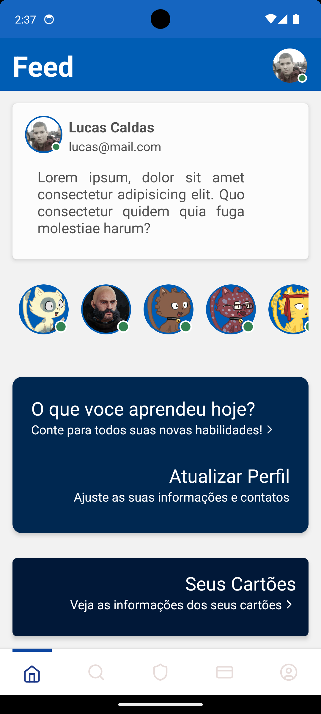

# SKILL+

## Descrição

Este projeto é uma aplicação mobile em React Native. É uma extensão da aplicação SKILL+ para compartilhamento de contatos e habilidades.

## Recursos

- Leitor de QR Code.
- Sistema de upload de foto e atualização de perfil.
- Possibilidade de adicionar habilidades ao perfil e torná-las privadas ou públicas.
- Possibilidade de adicionar contatos no perfil e torná-los privados ou públicos.
- Sistema de pesquisa de usuários, com as informações que o mesmo optou por deixar público.
- Sistema de cartões, podendo adicionar novos cartões com QR Code, ativar ou desativar, mudar informações e até imagem de background.
- Sistema de rotas pelo ReactNavigation utilizando StackNavigation e BottomTabNavigation

## Autenticação

Autenticação e autorização através do React Native utilzando AsyncStorage. Possui login social utilizando Google.

## Tecnologias Utilizadas

- React Native
- GlueStack para criação de componentes.
- Axios para API.
- React Hook Form para formulários.
- Yup para validação.
- ReactNavigation para rotas

## Em Desenvolvimento

- Sistema de filtros mais robusto.
- Sistema de mensagens em tempo real usando WebSockets.
- Sistema de envio de email.

## Telas

<p float="left">
  
  
  
  
  
  
  
  
</p>

## Como Instalar

Primeiro, faça a instalação dos pacotes através do gerenciador de sua preferência

```bash
# pnpm
pnpm install
```

depoins, monte rode a aplicação

```bash
# pnpm
npx expo run:android
```

## Licença

-----

## Learn More

This is a [Next.js](https://github.com/expo/expo) + [Gluestack-ui](https://ui.gluestack.io/) project template bootstrapped with [`create-expo-app`](https://docs.expo.dev/get-started/create-a-project/).

To learn more about Expo + Gluestack UI template, take a look at the following resources:

- [Expo Documentation](https://github.com/expo/expo) - learn about Expo features and API.
- [Gluestack UI Documenatation](https://ui.gluestack.io/docs/overview/introduction) - learn about core concepts and architecture of gluestack-ui.
- [Gluestack Style Documentaion](https://style.gluestack.io/docs/overview/introduction) - learn about the universal styling library that is used in Gluestack-ui

You can check out:
- [the gluestack-ui GitHub repository](https://github.com/gluestack/gluestack-ui)
- [the gluestack-style GitHub repository](https://github.com/gluestack/gluestack-style)
Your feedback and contributions are welcome!
